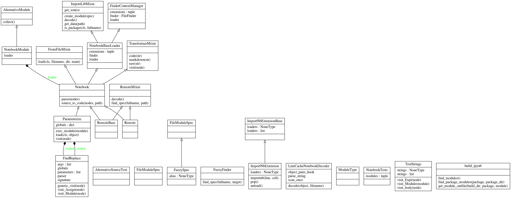

__importnb__ imports notebooks as modules.  Notebooks are reusable as tests, source code, importable modules, and command line utilities.

[](https://mybinder.org/v2/gh/deathbeds/importnb/master?urlpath=lab/tree/readme.ipynb)[](https://importnb.readthedocs.io/en/latest/?badge=latest)
[](https://travis-ci.org/deathbeds/importnb)[](https://badge.fury.io/py/importnb)[
](https://anaconda.org/conda-forge/importnb)[
](https://github.com/deathbeds/importnb/tree/master/src/importnb) [](https://github.com/psf/black)


##### Installation

    pip install importnb
    
---

    conda install -c conda-forge importnb

---

# `importnb` for testing

After `importnb` is installed, [pytest](https://pytest.readthedocs.io/) will discover and import notebooks as tests.

    pytest index.ipynb

[`importnb`](https://github.com/deathbeds/importnb) imports notebooks as python modules, it does not compare outputs like [`nbval`](https://github.com/computationalmodelling/nbval).  

[`importnb`](https://github.com/deathbeds/importnb) now captures `doctest`s in every __Markdown__ cell & block string expression.  The docstrings are tested with the [__--doctest-modules__ flag](https://doc.pytest.org/en/latest/doctest.html).

    pytest index.ipynb --doctest-modules
    
It is recommended to use `importnb` with [__--nbval__](https://github.com/computationalmodelling/nbval) and the __--monotonic__ flag that checks if has notebook has be restarted and re-run.

    pytest index.ipynb --nbval --monotonic

---

# `importnb` for the commmand line

`importnb` can run notebooks as command line scripts.  Any literal variable in the notebook, may be applied as a parameter from the command line.

    ipython -m importnb -- index.ipynb --foo "A new value"
   

---

# `importnb` for Python and IPython


It is suggested to execute `importnb-install` to make sure that notebooks for each IPython session.

> Restart and run all or it didn't happen.

`importnb` excels in an interactive environment and if a notebook will __Restart and Run All__ then it may reused as python code. The `Notebook` context manager will allow notebooks _with valid names_ to import with Python.


```python
from importnb import Notebook
```

### For brevity


```python
    with __import__('importnb').Notebook(): 
        import readme
```

> [`importnb.loader`](src/notebooks/loader.ipynb) will find notebooks available anywhere along the [`sys.path`](https://docs.python.org/2/library/sys.html#sys.path).

#### or explicity 


```python
    from importnb import Notebook
    with Notebook(): 
        import readme
```


```python
    foo = 42
    with Notebook():
        import readme
    if __name__ == '__main__':
        assert readme.foo == 42
        assert readme.__file__.endswith('.ipynb')
```

[`importnb` readme](readme.ipynb)

### Modules may be reloaded 

The context manager is required to `reload` a module.


```python
    from importlib import reload
    with Notebook(): __name__ == '__main__' and reload(readme)
```

### Lazy imports

The `lazy` option will delay the evaluation of a module until one of its attributes are accessed the first time.


```python
    with Notebook(lazy=True):
        import readme
```

### Fuzzy File Names


```python
    if __name__ == '__main__':
        with Notebook():
            import __a_me
            
        assert __a_me.__file__ == readme.__file__
```

Python does not provide a way to import file names starting with numbers of contains special characters.  `importnb` installs a fuzzy import logic to import files containing these edge cases.

    import __2018__6_01_A_Blog_Post
    
will find the first file matching `*2018*6?01?A?Blog?Post`.  Importing `Untitled314519.ipynb` could be supported with the query below.

    import __314519

### Docstring

The first markdown cell will become the module docstring.


```python
    if __name__ == '__main__':
        print(readme.__doc__.splitlines()[0])
```

    __importnb__ imports notebooks as modules.  Notebooks are reusable as tests, source code, importable modules, and command line utilities.


Meaning non-code blocks can be executeb by [doctest]().


```python
    if __name__ == '__main__':
        __import__('doctest').testmod(readme)
```

# Import notebooks from files

Notebook names may not be valid Python paths.  In this case, use `Notebook.from_filename`.

```python
>>> Notebook.load('changelog.ipynb')
<module 'changelog' from 'changelog.ipynb'>
```
       
Import under the `__main__` context.

```python
>>> Notebook('__main__').load('changelog.ipynb')
<module 'changelog' from 'changelog.ipynb'>
```

# Parameterize Notebooks

Literal ast statements are converted to notebooks parameters.

In `readme`, `foo` is a parameter because it may be evaluated with ast.literal_val


```python
    if __name__ == '__main__':
        from importnb.parameterize import Parameterize
        f = Parameterize.load(readme.__file__)
```

The parameterized module is a callable that evaluates with different literal statements.


```python
    if __name__ == '__main__': 
        assert callable(f)
        f.__signature__

        assert f().foo == 42
        assert f(foo='importnb').foo == 'importnb'
```

# Run Notebooks from the command line

Run any notebook from the command line with importnb.  Any parameterized expressions are available as parameters on the command line.

    

```bash
ipython -m importnb -- index.ipynb --foo "The new value"
```

## Integrations


### IPython

#### [IPython Extension](src/importnb/ipython_extension.py#IPython-Extensions)

Avoid the use of the context manager using loading importnb as IPython extension.

```python
%load_ext importnb
```
    
`%unload_ext importnb` will unload the extension.

#### Default Extension

`importnb` may allow notebooks to import by default with 

```bash
importnb-install
```

> If you'd like to play with source code on binder then you must execute the command above.  Toggle the markdown cell to a code cell and run it.

This extension will install a script into the default IPython profile startup that is called each time an IPython session is created.  

Uninstall the extension with `importnb-uninstall`.

##### Run a notebook as a module

When the default extension is loaded any notebook can be run from the command line. After the `importnb` extension is created notebooks can be execute from the command line.

```bash
ipython -m readme
```
    
In the command line context, `__file__ == sys.argv[0] and __name__ == '__main__'` .
    
> See the [deploy step in the travis build](https://github.com/deathbeds/importnb/blob/docs/.travis.yml#L19).

##### Parameterizable IPython commands

Installing the IPython extension allows notebooks to be computed from the command.  The notebooks are parameterizable from the command line.

```bash
ipython -m readme -- --help
```

### py.test

`importnb` installs a pytest plugin when it is setup.  Any notebook obeying the py.test discovery conventions can be used in to pytest.  _This is great because notebooks are generally your first test._

```bash
ipython -m pytest -- src
```
    
Will find all the test notebooks and configurations as pytest would any Python file.

### Setup

To package notebooks add `recursive-include package_name *.ipynb`

## Developer

* [Python Source](./src/importnb/)
* [Tests](./tests)

### Format and test the Source Code


```python
    if __name__ == '__main__':
        if globals().get('__file__', None) == __import__('sys').argv[0]:
            print(foo, __import__('sys').argv)
        else:
            !ipython -m pytest -- --cov=importnb --flake8 --isort --black tests 
            !jupyter nbconvert --to markdown --stdout index.ipynb > readme.md
```

    ]0;IPython: deathbeds/importnb========================================== test session starts ==========================================
    platform linux -- Python 3.8.1, pytest-5.3.2, py-1.8.1, pluggy-0.13.1 -- /home/weg/projects/deathbeds/importnb/envs/importnb-dev/bin/python
    cachedir: .pytest_cache
    rootdir: /home/weg/projects/deathbeds/importnb, inifile: tox.ini
    plugins: isort-0.3.1, black-0.3.7, flake8-1.0.4, cov-2.8.1, importnb-0.6.0
    collected 22 items                                                                                      
    
    tests/foobar.py::FLAKE8 SKIPPED                                                                   [  4%]
    tests/foobar.py::BLACK SKIPPED                                                                    [  9%]
    tests/foobar.py::ISORT SKIPPED                                                                    [ 13%]
    tests/test_importnb.ipynb::test_basic PASSED                                                      [ 18%]
    tests/test_importnb.ipynb::test_package PASSED                                                    [ 22%]
    tests/test_importnb.ipynb::test_reload PASSED                                                     [ 27%]
    tests/test_importnb.ipynb::test_docstrings PASSED                                                 [ 31%]
    tests/test_importnb.ipynb::test_docstring_opts PASSED                                             [ 36%]
    tests/test_importnb.ipynb::test_from_file PASSED                                                  [ 40%]
    tests/test_importnb.ipynb::test_lazy PASSED                                                       [ 45%]
    tests/test_importnb.ipynb::test_module_source PASSED                                              [ 50%]
    tests/test_importnb.ipynb::test_main PASSED                                                       [ 54%]
    tests/test_importnb.ipynb::test_object_source PASSED                                              [ 59%]
    tests/test_importnb.ipynb::test_python_file PASSED                                                [ 63%]
    tests/test_importnb.ipynb::test_cli PASSED                                                        [ 68%]
    tests/test_importnb.ipynb::test_parameterize PASSED                                               [ 72%]
    tests/test_importnb.ipynb::test_minified_json PASSED                                              [ 77%]
    tests/test_importnb.ipynb::test_fuzzy_finder PASSED                                               [ 81%]
    tests/test_importnb.ipynb::test_remote PASSED                                                     [ 86%]
    tests/foobaz/__init__.py::FLAKE8 SKIPPED                                                          [ 90%]
    tests/foobaz/__init__.py::BLACK SKIPPED                                                           [ 95%]
    tests/foobaz/__init__.py::ISORT SKIPPED                                                           [100%]Coverage.py warning: Module importnb was previously imported, but not measured (module-not-measured)
    
    
    ----------- coverage: platform linux, python 3.8.1-final-0 -----------
    Name                                    Stmts   Miss  Cover
    -----------------------------------------------------------
    src/importnb/__init__.py                    5      0   100%
    src/importnb/__main__.py                    6      2    67%
    src/importnb/_version.py                    1      0   100%
    src/importnb/completer.py                  54     54     0%
    src/importnb/decoder.py                    56      7    88%
    src/importnb/docstrings.py                 43      7    84%
    src/importnb/finder.py                     62      8    87%
    src/importnb/ipython_extension.py          70     39    44%
    src/importnb/loader.py                    159     31    81%
    src/importnb/parameterize.py               95     12    87%
    src/importnb/remote.py                     49      8    84%
    src/importnb/utils/__init__.py              1      1     0%
    src/importnb/utils/export.py               33     33     0%
    src/importnb/utils/ipython.py              47     47     0%
    src/importnb/utils/nbdoctest.py            32     32     0%
    src/importnb/utils/pytest_importnb.py      32     19    41%
    src/importnb/utils/setup.py                52     52     0%
    -----------------------------------------------------------
    TOTAL                                     797    352    56%
    
    
    ===================================== 16 passed, 6 skipped in 1.58s =====================================
    [NbConvertApp] Converting notebook index.ipynb to markdown


```python
    if __name__ == '__main__':
        try:
            from IPython.display import display, Image
            from IPython.utils.capture import capture_output
            from IPython import get_ipython
            with capture_output(): 
                get_ipython().system("cd docs && pyreverse importnb -opng -pimportnb")
            display(Image(url='docs/classes_importnb.png', ))
        except: ...
```




